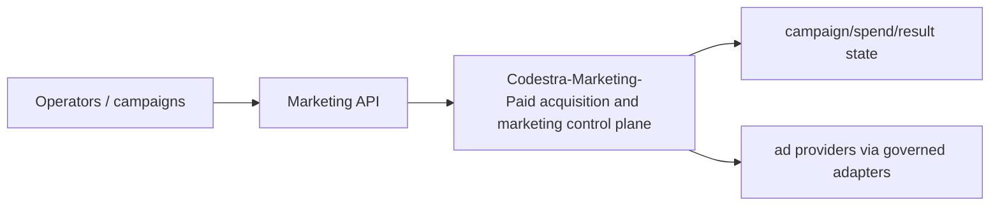
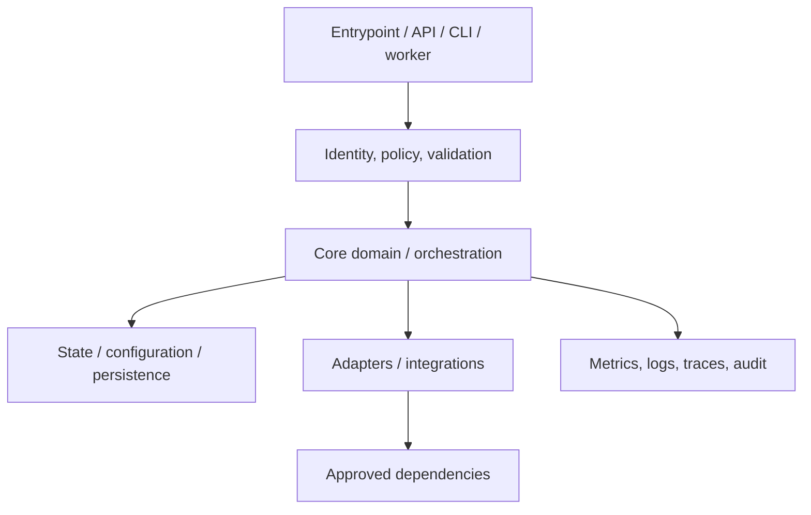
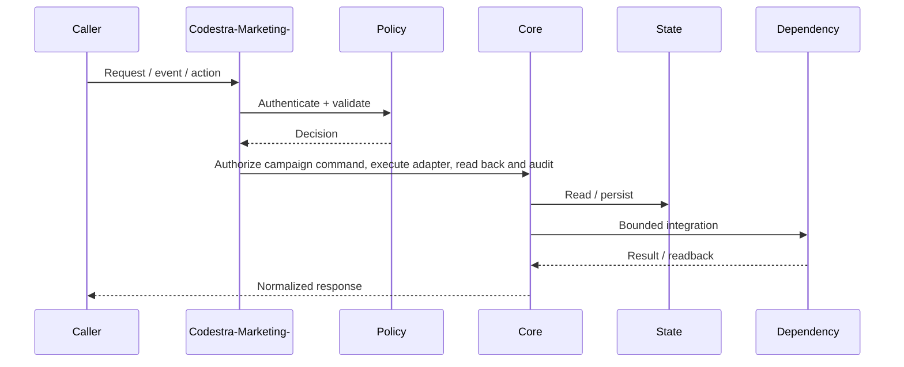
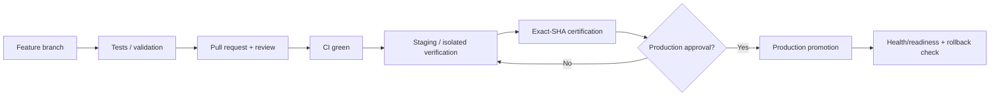
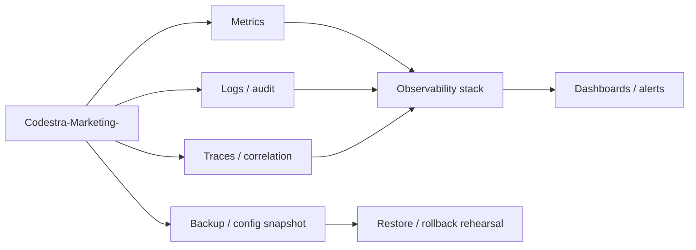

# Codestra-Marketing- — Architecture Charts

> Repository: `appolon1908/Codestra-Marketing-`  
> Baseline branch: `main`  
> Repository-local visual architecture. Keep these diagrams aligned with source, contracts and deployment.

## 1. System context

## 2. Internal component architecture

## 3. Critical flow

## 4. Deployment and promotion

## 5. Observability and recovery

## Ownership notes
- **Role:** Paid acquisition and marketing control plane
- **Primary boundary:** Marketing API
- **State/config:** campaign/spend/result state
- **Dependencies/consumers:** ad providers via governed adapters
- Cross-repository effects must use reviewed contracts; production effects remain separately gated.
